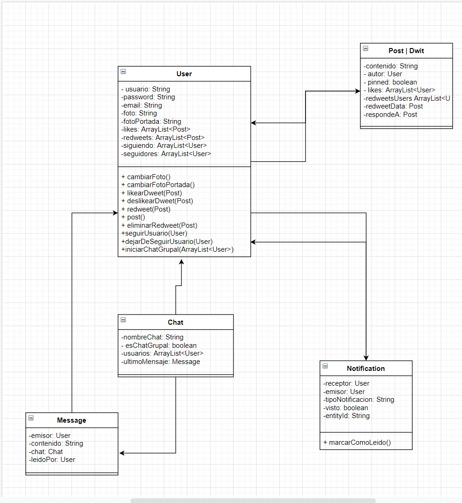

# Dwitter 🐦
⚠️ In Progress ⚠️

## ¿Cómo correr el proyecto? 👀
Pararse en la raiz del proyecto `./Dwitter` y en terminal, correr `npm install` y luego `npm start`, luego ir a `localhost:8080` (Ya que apunta por defecto al puerto 8080)

* Si aparece en consola el siguiente error `TextEncoder is not defined` para la dependencia `whatwg-url`, ir a `node_modules/whatwg-url/dist/encoding.js` y agregar la linea `const { TextEncoder, TextDecoder } = require("util");` en la parte de arriba de todo de este archivo. 
* Este proyecto fue hecho con la version 10 de NodeJS. 

## Tecnologias
* Se eligio NodeJS con Express para el backend por la rapidez de desarrollo que brinda. Tambien porque su integracion con Socket.IO es muy simple. ✔️
* Se eligio Pug como frontend engine ya que esta basado en Javascript y brinda una sintaxis muy sencilla para HTML, acelerando asi el desarrollo de este proyecto para que nos podamos concentrar puramente en el funcionamiento del backend ✔️
* Se eligio MongoDB como Base de Datos. Al ser una base de datos no relacional, se brindaran los Schemas como documentacion, ya que no hay relaciones entre las entidades como pude suceder en una base de datos relacional. ✔️
* El frontend se complementará con Bootstrap ✔️
* Todavia no se definio a que plataforma será subido este proyecto.

## Schemas
Los mismos pueden variar a medida que se va desarrollando el proyecto
### User
```javascript
    usuario : {
        type: String,
        required: true,
        trim: true,
        unique: true,
    },
    password : {
        type: String,
        required: true,
        trim: false,
    },
    email : {
        type: String,
        required: true,
        trim: true,
        unique: true,
    },
    foto : {
        type: String,
        default: '/images/profileDefault.png'
    },
    fotoPortada: { type: String },
    likes: [{ type: Schema.Types.ObjectId, ref: 'Post' }],
    redweets: [{ type: Schema.Types.ObjectId, ref: 'Post' }],
    siguiendo: [{ type: Schema.Types.ObjectId, ref: 'User' }],
    seguidores: [{ type: Schema.Types.ObjectId, ref: 'User' }]
}, {timestamps: true});
``` 
* Se esta evaluando agregar Nombre o una especie de ShowName para simular el funcionamiento de Twitter, donde el usuario puede modificar su nombre que aparece al lado de su nombre de usuario.

### Chat 

```javascript
    nombreChat: { type: String, trim: true },
    esChatGrupal: { type: Boolean, default: false },
    usuarios: [{ type: Schema.Types.ObjectId, ref: 'User' }],
    ultimoMensaje: { type: Schema.Types.ObjectId, ref: 'Message' }
}, { timestamps: true });
```
### Message 

```javascript
 emisor: { type: Schema.Types.ObjectId, ref: 'User' },
    contenido: { type: String, trim: true },
    chat: { type: Schema.Types.ObjectId, ref: 'Chat' },
    leidoPor: [{ type: Schema.Types.ObjectId, ref: 'User' }]
}, { timestamps: true });
```

### Notification

```javascript
 receptor: { type: Schema.Types.ObjectId, ref: 'User' },
    emisor: { type: Schema.Types.ObjectId, ref: 'User' },
    tipoNotificacion: String,
    visto: { type: Boolean, default: false },
    entityId: Schema.Types.ObjectId
}, { timestamps: true });
```

### Post (O Dwit)

```javascript
    contenido: { type: String, trim: true },
    autor: { type: Schema.Types.ObjectId, ref: 'User' },
    pinned: Boolean,
    likes: [{ type: Schema.Types.ObjectId, ref: 'User' }],
    redweetsUsers: [{ type: Schema.Types.ObjectId, ref: 'User' }],
    redweetData: { type: Schema.Types.ObjectId, ref: 'Post' },
    respondeA: { type: Schema.Types.ObjectId, ref: 'Post' },
}, { timestamps: true });
```



# Funcionalidades (TODOs) 📖
* El usuario podrá logearse, registrarse en la plataforma y Twittear. ✔️
* La plataforma es responsive.
* Implementar nvm para mantener la version de Node actualmente utilizada.
* Los twits podrán ser retwitteados, likeados, respondidos y borrados (por el mismo autor). 
* Tambien existirá la opcion de enviar mensajes privados, hacer salas de chat con varios usuarios, y hablar desde ahi (Hecho con la magia de `Socket.io`). Los chats traeran los mensajes viejos que el usuario no llegó a leer en el momento
* El usuario podrá setear su perfil en el momento que lo desee, para, por ejemplo, cambiar la foto de perfil
* Habrán notificaciones en Real-Time
* Se mantendrá una sesion de usuario ✔️
* El usuario podrá seguir a otros usuarios para ver sus Twits en el inicio. 
* En este proyecto los Twits pasarán a ser llamados Dwits. ✔️
* Implementar Login con Google, Facebook, etc.. con Firebase (Nice to Have)
